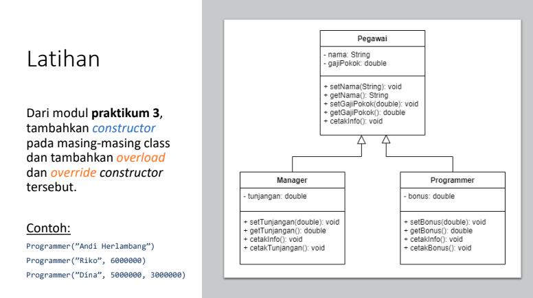

# Tugas Praktikum 6 (Pertemuan ke 7) 

|Nama|NIM|Kelas|Mata Kuliah|
|----|---|-----|------|
|**Radityatama Nugraha**|**312310644**|**TI.23.A6**|**Pemrograman Orientasi Objek**|



#  • Dari modul praktikum 3, tambahkan constructor pada masing-masing class dan tambahkan overload dan override constructor tersebut.
#  • Contoh:
```
Programer ("Andi Herlambang")
Programer ("Riko", 6000000")
Programer ("Dina", 5000000, 3000000)
```

##  • Kelas Pegawai
```java
class Pegawai {
    private String nama;
    private double gajiPokok;

    public Pegawai(String nama, double gajiPokok) {
        this.nama = nama;
        this.gajiPokok = gajiPokok;
    }

    public Pegawai(String nama) {
        this.nama = nama;
        this.gajiPokok = 0; 
    }

    public void setNama(String nama) {
        this.nama = nama;
    }

    public String getNama() {
        return nama;
    }

    public void setGajiPokok(double gajiPokok) {
        this.gajiPokok = gajiPokok;
    }

    public double getGajiPokok() {
        return gajiPokok;
    }

    public void cetakInfo() {
        System.out.printf("Nama: %s, Gaji Pokok: %.0f%n", nama, gajiPokok);
    }
}
```

###  • Penjelasan Kelas Pegawai:
```
- Atribut:

- private String nama: Menyimpan nama pegawai. Atribut ini bersifat private, yang berarti hanya dapat diakses melalui metode dalam kelas ini.
- private double gajiPokok: Menyimpan gaji pokok pegawai.

- Konstruktor:

- public Pegawai(String nama, double gajiPokok): Konstruktor ini digunakan untuk menginisialisasi objek Pegawai dengan nama dan gaji pokok yang diberikan.
- public Pegawai(String nama): Konstruktor ini hanya menginisialisasi nama pegawai dan menetapkan gaji pokok menjadi 0.

- Metode Set dan Get:

- public void setNama(String nama): Metode ini digunakan untuk mengubah nama pegawai.
- public String getNama(): Metode ini mengembalikan nama pegawai.
- public void setGajiPokok(double gajiPokok): Metode ini digunakan untuk mengubah gaji pokok pegawai.
- public double getGajiPokok(): Metode ini mengembalikan gaji pokok pegawai.

- Metode cetakInfo():

- Metode ini mencetak informasi pegawai (nama dan gaji pokok) ke layar dengan format tertentu.
```
